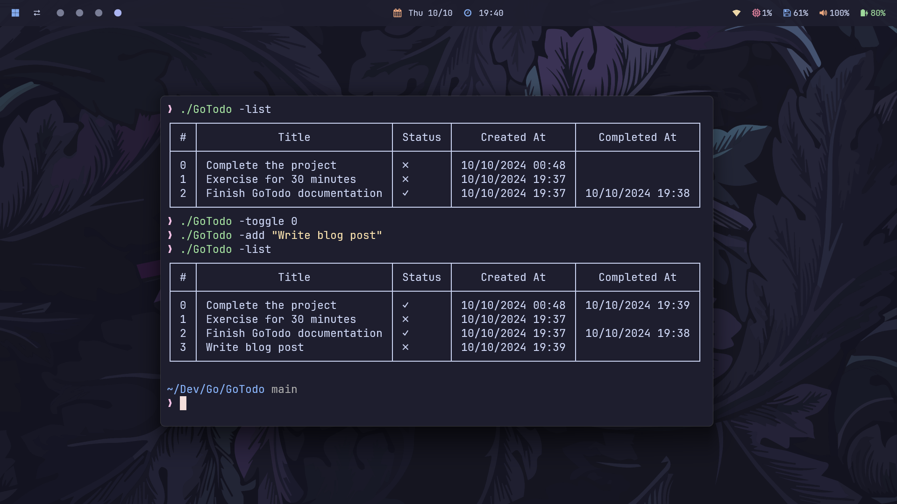

# 📝 GoTodo

GoTodo is a simple CLI todo list application written in Go. It allows users to add, edit, delete, toggle, and list tasks directly from the terminal, with todos saved in a JSON file for persistence.



## ✨ Features

- Add a new todo
- Edit existing todos by index
- Toggle todos as completed/incomplete
- Delete todos by index
- List all todos with status and timestamps
- Persistent storage via JSON file

## 🛠️ Installation

1. Clone the repository:

```bash
git clone https://github.com/ashish0kumar/GoTodo.git
cd GoTodo
```

2. Build the project:

```bash
go build
```

3. Run the CLI app:

```bash
./GoTodo
```

**Configure Global CLI Access (Optional)**

Move the executable to a directory in your system’s PATH (e.g., `/usr/local/bin`) so it can be accessed from anywhere in the terminal:

```bash
sudo mv GoTodo /usr/local/bin/
```

By default, GoTodo stores tasks in a todos.json file located in your home directory under a .gotodo folder `~/.gotodo/todos.json`. This ensures that the file is not generated in every directory you run the command from.

If the folder doesn't already exist, GoTodo will automatically create it the first time you run the app.

## 🔧 Usage

GoTodo supports several command-line flags for managing your todo list:

- **Add a new todo:**

```bash
./GoTodo -add "Buy groceries"
```

- **Edit an existing todo by index:**

```bash
./GoTodo -edit "0:Buy milk"
```

- **Delete a todo by index:**

```bash
./GoTodo -del 0
```

- **Toggle a todo's completion status by index:**

```bash
./GoTodo -toggle 0
```

- **List all todos:**

```bash
./GoTodo -list
```

- **Todos File**

All todos are stored in a `todos.json` file in the project directory for persistence. The file is automatically created if it doesn't exist.

<br>

**Example Output**

```bash
┌───┬─────────────────────────────┬────────┬──────────────────┬──────────────────┐
│ # │            Title            │ Status │    Created At    │   Completed At   │
├───┼─────────────────────────────┼────────┼──────────────────┼──────────────────┤
│ 0 │ Buy groceries               │ ✗      │ 10/10/2024 12:30 │                  │
│ 1 │ Complete the project        │ ✓      │ 10/10/2024 12:00 │ 10/10/2024 12:45 │
│ 2 │ Exercise for 30 minutes     │ ✓      │ 09/10/2024 08:00 │ 09/10/2024 08:45 │
│ 3 │ Write blog post             │ ✗      │ 10/10/2024 14:00 │                  │
│ 4 │ Finish GoTodo documentation │ ✓      │ 10/10/2024 13:00 │ 10/10/2024 13:45 │
└───┴─────────────────────────────┴────────┴──────────────────┴──────────────────┘
```
